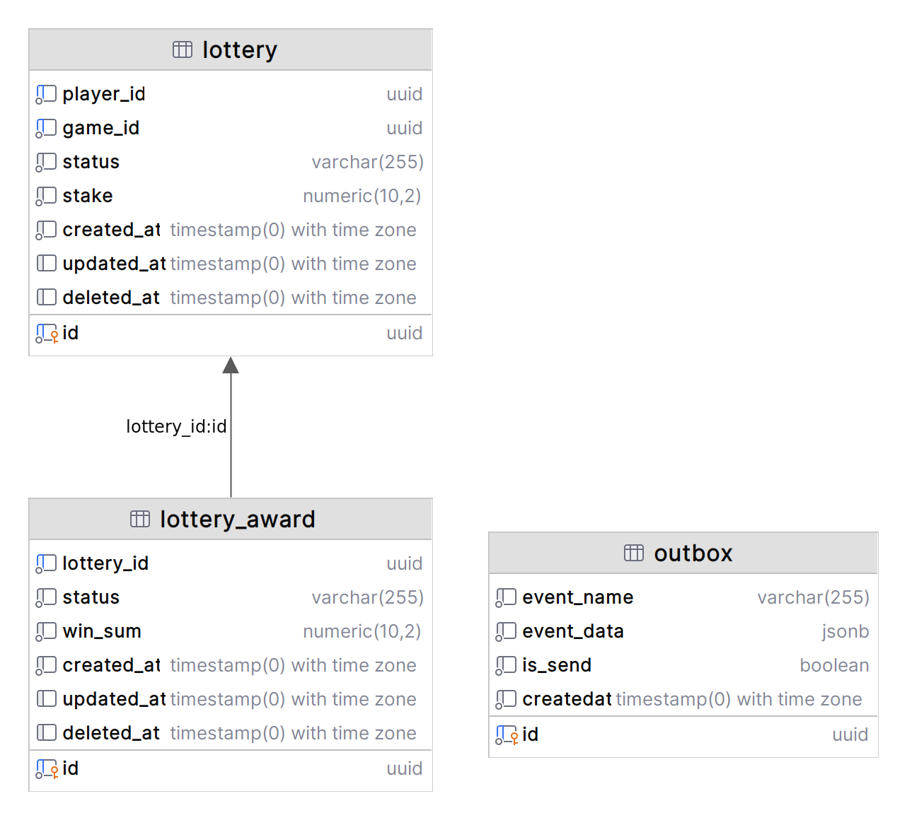

# Lottery Service


## Features

- Each command is handled by a separate container.
- **Resource isolation:**
    - Each container runs in its own environment, ensuring resource isolation. If one of the teams becomes overloaded, it does not affect the others.
- **Flexibility of configuration:**
    - Different commands may require different dependencies, settings, or PHP versions. Using separate containers provides customization flexibility for each team.

---

- Alternative usage scenario for processing streams in a cafe through Kafka Connector, KsqlDb. 
- **The PostgreSQL Source connector:**
    - Can fetch an instantaneous snapshot of data directly from the Outbox table and track all subsequent changes at the row level. 
    - The Source connector can automatically create topics and write messages to them. 
- **Note that the ID field in the Outbox table must be incremental and have an integer type** 
    - in the Lottery Service, the PostgreSQL Source connector is configured to retrieve sequential data from the database based on the timestamp field - mode='timestamp'.

## Overview

- This is one of the services that involves a lottery draw when a player places a bet.
- For example, a player registers in the system, makes a deposit, then selects a game and places a sports bet.
- Data for the Lottery model is sourced from another service, such as a gaming service.
- In the gaming service, a user places a bet on a game, and as soon as the bet is made, the gaming service sends events of the player's actions to the Kafka broker.
- The lottery service subscribes to the **"player.v1.staked"** topic with a message type of **"player.stakeCreated"**. After the lottery service receives the message data, it creates a lottery for the respective player based on their ID and the ID of the game in which they placed the bet.
- After a specific number of players who placed the initial bet have been gathered, the lottery drawing begins, and the status is updated from "in_waiting" to "started."
- The winner is selected, and once the winner is determined, the status in the lottery table is updated from "started" to "finished," and the winner's status set to "winner."
- After determining the winner, the data **'lottery_id'** and **'win_sum'** are recorded in the **`lottery_award`** table, and the status **'played_out'** is added. Once **`LotteryAward`** is created, the domain event **`AwardCreated`** is triggered. The event is sent to a subscriber in the Outbox, and the event data is recorded in the **`Outbox`** table.
- The producer (run by a daemon) sends the data from the Outbox table to Kafka, creating the topic **'lottery.v1.award'** with the messageType **`lotteryAwardCreated`**.
- Other services, typically **`PlayerService`**, read this topic to inform the player that they have won a prize.

---

## Database Structure



---

## How the Process Works

1. **KafkaWorker:** Initiates a polling ReactPHP event loop in Kafka, adding the consumer_group_id **"lottery_service_consumer_group"** in the **"player.v1.staked"** topic.
    - Let's imagine that we have a **Game Service** that sends data to a Kafka topic subscribed to by the Lottery Service. The **Lottery Service** receives data from the topic, processes it, and populates the **"lottery"** table, specifying the status as **"in_waiting"**.

2. **[LotteryCreateHandler](src%2FLottery%2FApplication%2FUseCase%2FLotteryCreateHandler.php):** Processes received messages with ReactPHP to create a Lottery.

3. **[UpdateLotteryToStartCommand](src%2FLottery%2FApplication%2FCommand%2FUpdateLotteryToStartCommand.php):** In the **[LotteryUpdateStatusToStartedHandler](src%2FLottery%2FApplication%2FUseCase%2FLotteryUpdateStatusToStartedHandler.php)**, this handler updates the Lottery status and selects the list of participants with the status **"started"**.

4. **[ProcessRunDetermineWinner](src%2FLottery%2FApplication%2FConsole%2FCommand%2FProcessRunDetermineWinner.php):** Determines the lottery winner.

5. **[UpdateLotteryToStartCommand](src%2FLottery%2FApplication%2FCommand%2FUpdateLotteryToStartCommand.php):** To the **[LotteryUpdateStatusToStartedHandler](src%2FLottery%2FApplication%2FUseCase%2FLotteryUpdateStatusToStartedHandler.php)** handler to update the status to **"finished"** since his status is updated to **"winner"**.

6. **[LotteryAward](src%2FLottery%2FModel%2FLotteryAward.php):** Initialized domain event **[AwardCreated](src%2FLottery%2FModel%2FEvents%2FAwardCreated.php)**.

7. **[OutboxEventHandler](src%2FOutbox%2FApplication%2FUseCase%2FOutboxEventHandler.php):** Handles **[AwardCreated](src%2FLottery%2FModel%2FEvents%2FAwardCreated.php)** and saves event data in the Outbox table.

8. **[OutboxSchedule](src%2FOutbox%2FApplication%2FConsole%2FScheduler%2FOutboxSchedule.php):** Gets records from the Outbox table to produce messages.

9. **[OutboxSchedulerMessageHandler](src%2FOutbox%2FApplication%2FUseCase%2FOutboxSchedulerMessageHandler.php):** Guarantees the delivery of messages without duplication.

### Build Locally

1. Run `docker-compose up --build`.
2. Send test data for Kafka using the POST method to [http://127.0.0.1:81/stake](http://127.0.0.1:81/stake)

# Build and Run

The Lottery Service project is built and managed using Docker. Below are the available make targets to build and run the project.

## Make Targets

### Build Docker Images

To build Docker images, run the following command:

```bash
make build
```
This command also copies configuration files from their .dist files.
